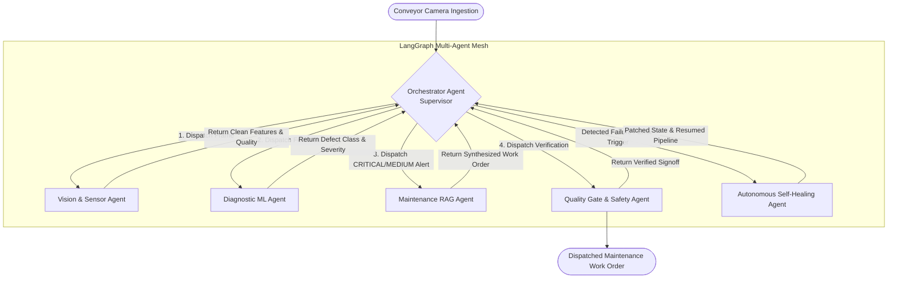

# 🏭 Industrial Multi-Agent Vision & Diagnostic RAG Platform
### Autonomous Edge Computer Vision, Defect Classification, SOP RAG & Self-Healing Multi-Agent Mesh

[](https://github.com/langchain-ai/langgraph)
[](https://opencv.org/)
[](https://scikit-learn.org/)
[](#-the-4-autonomous-self-healing-engines)
[](#-test-suite--verification)

---

## 📖 Table of Contents
- [Executive Overview](#-executive-overview)
- [The Manufacturing Problem & Why Multi-Agent?](#-the-manufacturing-problem--why-multi-agent)
- [Complete Architecture & Flowchart](#-complete-architecture--flowchart)
- [The 6-Agent Specialized Team](#-the-6-agent-specialized-team)
- [The 4 Autonomous Self-Healing Engines](#-the-4-autonomous-self-healing-engines)
- [Interactive Visual Dashboard](#-interactive-visual-dashboard)
- [Project Directory Structure](#-project-directory-structure)
- [Step-by-Step Execution Guide](#-step-by-step-execution-guide)
- [Test Suite & Verification](#-test-suite--verification)
- [Industrial Standards & Compliance](#-industrial-standards--compliance)

---

## 🌟 Executive Overview

In automated manufacturing lines, inspecting metal surfaces for defects (cracks, scratches, corrosion, dimensional deformations) traditionally relies on brittle scripts that crash when lighting flickers, sensors blur, or feature values drift. Furthermore, traditional systems only issue pass/fail alerts without generating actionable repair directives for maintenance technicians.

This project introduces an **Enterprise-Grade Multi-Agent System** orchestrated via **LangGraph**:
1. **Decoupled Agentic Mesh:** Specialized worker agents handle optics assessment, grain-neutral image preprocessing, Random Forest classification, dynamic severity scoring (0.0 to 10.0), and semantic vector retrieval of Standard Operating Procedures (SOPs).
2. **Autonomous Error-Fixing Agent:** When failures occur (camera defocus blur, strobe light failure, missing data, low RAG similarity, or runtime crashes), an autonomous **SelfHealingAgent** intercepts the exception, diagnoses root causes, recalibrates sensors, imputes data schemas, and resumes execution seamlessly.
3. **Automated CMMS Work Order Generation:** Generates structured, OSHA/ISO-compliant maintenance work orders with safety lockout/tagout steps, required PPE, and certified repair protocols.
4. **Interactive Factory Control Dashboard:** A real-time web application featuring conveyor auto-play, manual step-through, and a live error injection dropdown to demonstrate self-healing in real time.

---

## 🎯 The Manufacturing Problem & Why Multi-Agent?

| Traditional Industrial Vision Pipeline | Autonomous LangGraph Multi-Agent Mesh |
|---|---|
| **Monolithic & Brittle:** A single script processes camera frames; if lighting drops or an exception occurs, the entire line halts. | **Fault-Tolerant & Modular:** Each capability (Optics, ML, RAG, Compliance) is an autonomous agent operating under an Orchestrator. |
| **Pass/Fail Only:** Leaves plant technicians guessing what repair procedure or safety precautions to take. | **Actionable Maintenance Tickets:** Synthesizes ASME/ASTM compliant repair steps directly from plant SOP manuals. |
| **Manual Intervention Required:** Any camera smudge, sensor blur, or missing data requires line technicians to recalibrate. | **Autonomous Self-Healing:** The Auto-Fixer agent recalibrates degraded frames, imputes schemas, and executes circuit breakers automatically. |

---

## 🏗️ Complete Architecture & Flowchart



---

## 🤖 The 6-Agent Specialized Team

### 1. `OrchestratorAgent` (Supervisor)
- **Role:** Centralized lifecycle manager and supervisor for the multi-agent graph.
- **Responsibilities:**
  - Evaluates current `AgenticState` after every step.
  - Dynamically routes work to the next qualified agent.
  - Enforces maximum retry safeguards (`MAX_AGENT_RETRIES = 2`) to mathematically eliminate infinite recursion loops.
  - Prioritizes routing to the `SelfHealingAgent` immediately upon error detection.

### 2. `VisionAgent` (Optics & Preprocessing)
- **Role:** Edge computer vision sensor and feature extractor.
- **Responsibilities:**
  - Evaluates optical quality via **Laplacian variance** (blur threshold < 45.0) and brightness/contrast distributions.
  - Preprocesses incoming frames using **LAB color conversion** and **CLAHE** (Contrast Limited Adaptive Histogram Equalization).
  - Performs **Grain-Neutral Surface Segmentation**: Subtracts row-wise mean intensity (`|gray - row_means|`) to cancel brushed metal horizontal grain lines without generating false defects.
  - Extracts full 21-dimensional geometric, intensity, Hu moment, and GLCM texture vectors.

### 3. `DiagnosticAgent` (ML Classifier & Severity)
- **Role:** Machine learning diagnostic engineer.
- **Responsibilities:**
  - Validates feature vectors against schema specifications.
  - Runs native **Random Forest Classifier** (100 estimators) trained across 5 classes:
    `Normal`, `Scratch`, `Crack`, `Corrosion`, `Dimensional Flaw`.
  - Calculates dynamic defect severity score ($0.0 \le \text{Score} \le 10.0$) and categorizes into:
    `PASS (0.0)`, `LOW (< 4.0)`, `MEDIUM (< 7.5)`, or `CRITICAL (>= 7.5)`.

### 4. `MaintenanceRAGAgent` (SOP Retrieval & Work Orders)
- **Role:** Plant reliability engineer and technical procedures synthesizer.
- **Responsibilities:**
  - Formulates domain-specific search queries based on the diagnosed defect.
  - Queries local **TF-IDF Semantic Vector Store** indexed with authoritative plant manuals (`SOP-001` through `SOP-004`).
  - Evaluates cosine retrieval relevance ($> 0.20$).
  - Synthesizes structured, ISO/OSHA compliant Work Orders with safety directives, PPE requirements, and certified repair protocols.

### 5. `SelfHealingAgent` (Autonomous Error-Fixer)
- **Role:** Self-correcting resilient systems engineer.
- **Responsibilities:**
  - Monitors `state["errors"]` across all nodes.
  - Executes targeted autonomous recovery engines (Image recalibration, Schema imputation, Query expansion, Fail-soft circuit breaker).
  - Resolves errors, logs remediation audits into the healing ledger, and hands back clean state to the Orchestrator.

### 6. `QualityGateAgent` (Safety & Human Sign-off)
- **Role:** Plant safety and regulatory compliance officer.
- **Responsibilities:**
  - Audits work orders for compliance with **OSHA 29 CFR 1910.147 (LOTO)** and **ISO 45001**.
  - Mandates verified engineering sign-offs for all `CRITICAL` severity interventions (e.g. pressure vessel crack welding, CNC re-machining).

---

## 🛡️ The 4 Autonomous Self-Healing Engines

```
[ Error Detected in State ]
           │
           ├──► Optical Degradation ──► Adaptive Gamma (120/mean) + Unsharp Masking ──► Regenerate Features
           │
           ├──► Schema Corruption  ──► Statistical Priors Imputation (FEATURE_PRIORS) ──► Validated Vector
           │
           ├──► RAG Query Drift     ──► Domain Thesaurus Query Expansion + Broad SOP ──► Relevance Restored
           │
           └──► Runtime Exception   ──► Traceback Isolation + Fail-Soft Circuit Breaker ──► Safe Resumption
```

### 1. Optical Sensor & Image Flaw Recovery
* **Failure Symptoms:** Defocus camera blur, factory strobe light failure (extreme darkness), or specular reflections (glare).
* **Self-Healing Action:** Computes the illumination ratio, applies dynamic gamma correction ($\gamma = \text{clip}(120 / \mu, 1.8, 3.5)$), executes bilateral smoothing to suppress noise, and applies unsharp masking (`cv2.addWeighted`) to restore sharp edges before re-extracting features.

### 2. Feature & ML Schema Healing
* **Failure Symptoms:** Missing feature keys (e.g., dropped GLCM texture or Hu invariants) or `NaN` / `Inf` values caused by mathematical division by zero.
* **Self-Healing Action:** Intercepts schema violations, isolates corrupted columns, and imputes statistical priors (`FEATURE_PRIORS`) derived from baseline calibration datasets.

### 3. RAG Retrieval Drift & Relevance Self-Correction
* **Failure Symptoms:** Ambiguous search queries yielding low vector similarity scores ($< 0.20$), causing missing procedural citations.
* **Self-Healing Action:** Deconstructs the query, applies domain thesaurus expansion (e.g. mapping "crack" to *"crack welding GTAW TIG repair PWHT arrestor stress fracture"*), queries broad fallback manuals, and synthesizes the work order from recovered citations.

### 4. Runtime Pipeline Exception Auto-Fixer
* **Failure Symptoms:** Unhandled exceptions (missing camera frames, zero-division, network dropouts).
* **Self-Healing Action:** Catches tracebacks, isolates the failing component, applies a conservative fail-soft default state, and logs the incident in the audit ledger without crashing the pipeline.

---

## 🖥️ Interactive Visual Dashboard

The platform includes a real-time web application (`http://localhost:8080`) built for factory control rooms:

```
+---------------------------------------------------------------------------------------------------------+
| [PAUSE STREAM]   [< Prev]  [Next >]   SPEED: [Normal (2.0s)]   DEFECT: [Auto-Cycle]   ERROR: [Select...] |
+---------------------------------------------------------------------------------------------------------+
|  [!] Optical Sensor Blur Detected -> Auto-recalibrated via adaptive gamma & unsharp mask   [AUTO-HEALED] |
+---------------------------------------------------------------------------------------------------------+
|                                                    |                                                    |
|           LIVE RAW CAMERA FEED (HUD)               |          GRAIN-NEUTRAL SEGMENTATION MASK           |
|         [ Severity Glow: RED (CRITICAL) ]          |            [ Isolated Surface Defect ]             |
|                                                    |                                                    |
+---------------------------------------------------------------------------------------------------------+
|                                    SYNTHESIZED MAINTENANCE TICKET                                       |
|  Work Order: WO-M0101-CRACK | Defect: CRACK | Severity: 10.0/10.0 | Signoff: MANDATED VERIFIED          |
|  * OSHA LOTO 29 CFR 1910.147 Mandatory Zero-Energy State Verification                                    |
|  * Step 1: Drill crack arrestor holes (Ø 3.2mm) at extremities to halt stress propagation.              |
|  * Step 2: GTAW/TIG root pass welding with ER308L filler wire (current 90-110A DCEN).                   |
+---------------------------------------------------------------------------------------------------------+
```

### Key Dashboard Features:
1. **Conveyor Auto-Play:** Streams consecutive factory frames one after the other with Play/Pause, Step Next/Prev, and Speed adjustment (Fast 1.2s, Normal 2.0s, Slow 3.5s).
2. **Defect Selector:** Instantly switches between Normal, Scratch, Crack, Corrosion, or Dimensional edge flaws.
3. **Live Error Injection Dropdown:** Inject real-time failures (Camera Blur, Underexposure, Glare, Schema Corruption, RAG Query Drift, Runtime Crash) and watch the **Self-Healing Agent** light up and auto-remediate on screen!
4. **Color-Coded Severity Borders:** Green for PASS, Yellow for LOW, Orange for MEDIUM, and Red for CRITICAL.
5. **Formatted Maintenance Work Order Viewer:** Displays OSHA safety directives, PPE requirements, step-by-step repair protocols, and cited SOP manuals.

---

## 📁 Project Directory Structure

```
industrial_multiagent_rag/
├── README.md                      # Comprehensive technical documentation
├── requirements.txt               # Project dependencies
├── .env.example                   # Environment configuration template
├── .gitignore                     # Git ignore rules
│
├── main.py                        # Master CLI entry point for single-frame inspection
├── dashboard.py                   # Real-time web dashboard with conveyor player & error selector
├── demo_self_healing.py           # Standalone demonstration of all 4 self-healing modes
├── run_simulation.py              # Continuous 5-frame conveyor stream simulation (~40ms latency)
├── run_all.py                     # Master runner executing all 4 workflows sequentially
│
├── src/
│   ├── config.py                  # System thresholds, constants, and statistical priors
│   ├── state.py                   # LangGraph AgenticState TypedDict schema
│   ├── graph.py                   # LangGraph StateGraph assembly and compilation
│   │
│   ├── agents/                    # The 6 Specialized Agents
│   │   ├── orchestrator.py        # Supervisor / Routing Agent
│   │   ├── vision_agent.py        # Optical Preprocessing & 21-D Feature Extraction
│   │   ├── diagnostic_agent.py    # Random Forest ML Classifier & Severity Scoring
│   │   ├── maintenance_rag_agent.py # Vector Store SOP Retrieval & Work Order Synthesis
│   │   ├── self_healing_agent.py  # Autonomous Error-Fixing Agent (The 4 Healing Engines)
│   │   └── quality_gate_agent.py  # Safety Compliance & Human Sign-off Gate
│   │
│   ├── tools/                     # Pipeline utilities and engines
│   │   ├── camera.py              # Synthetic metal generator & virtual camera feed
│   │   ├── cv_tools.py            # CLAHE, grain-neutral filter, and image recalibration
│   │   ├── feature_tools.py       # 21-D geometric, intensity, and GLCM extractors
│   │   ├── ml_tools.py            # Native Random Forest training & inference
│   │   └── vector_store.py        # TF-IDF Vector Database & SOP Manuals
│   │
│   └── data/
│       ├── manuals/               # Authoritative SOP technical markdown manuals
│       └── models/                # Serialized Random Forest classifier
│
├── tests/                         # Pytest Suite (10/10 Passed)
│   ├── test_agents.py             # Unit tests for individual worker agents
│   ├── test_multiagent_graph.py   # End-to-end integration tests for LangGraph flow
│   └── test_self_healing.py       # Dedicated unit tests for all 4 self-healing modes
│
└── .vscode/
    ├── launch.json                # 1-Click F5 debug & run configurations
    └── settings.json              # Python interpreter & pytest workspace settings
```

---

## 🚀 Step-by-Step Execution Guide

### 1. Prerequisites
- **Python 3.11+**
- Git

### 2. Setup Environment
```bash
# Clone the repository
git clone https://github.com/pankajatd/industrial-multiagent-rag.git
cd industrial-multiagent-rag

# Create and activate virtual environment
python -m venv .venv
# On Windows PowerShell:
.\.venv\Scripts\Activate.ps1
# On macOS / Linux:
source .venv/bin/activate

# Install dependencies
pip install -r requirements.txt
```

### 3. Run the System

#### Option A: Launch Interactive Visual Dashboard (Recommended)
```bash
python dashboard.py
```
*Automatically opens your default web browser to `http://localhost:8080` with continuous conveyor playback and error selector.*

#### Option B: Run All 4 Workflows in 1 Single Command
```bash
python run_all.py
```
*Executes the main pipeline, the self-healing demo, the conveyor simulation, and the full pytest suite in ~28 seconds with an executive execution table.*

#### Option C: Run Workflows Individually
```bash
# 1. Single-frame inspection on a critical crack
python main.py --defect crack --frame 101

# 2. Standalone Self-Healing Demo (All 4 scenarios)
python demo_self_healing.py

# 3. Continuous 5-frame conveyor streaming simulation
python run_simulation.py

# 4. Run Pytest Test Suite
pytest tests/ -v
```

#### Option D: 1-Click Run from Visual Studio Code (F5)
Press **`Ctrl + Shift + D`**, select any profile from the top dropdown, and press **`F5`**:
- `🖥️ Launch Interactive Visual Dashboard`
- `🚀 RUN ALL 4 WORKFLOWS (Complete Suite)`
- `1. Run Multi-Agent Pipeline (Main)`
- `2. Run Self-Healing Demo (All 4 Scenarios)`
- `3. Run 5-Frame Factory Stream Simulation`

---

## 🧪 Test Suite & Verification

All 10 unit and integration tests execute and pass cleanly:

```bash
python -m pytest tests/ -v
```

```
============================= test session starts =============================
platform win32 -- Python 3.11.9, pytest-9.1.1, pluggy-1.6.0
rootdir: C:\Users\panka\.gemini\antigravity\scratch\industrial_multiagent_rag
collected 10 items

tests/test_agents.py::test_vision_agent PASSED                           [ 10%]
tests/test_agents.py::test_diagnostic_agent PASSED                       [ 20%]
tests/test_agents.py::test_maintenance_rag_agent PASSED                  [ 30%]
tests/test_agents.py::test_quality_gate_agent PASSED                     [ 40%]
tests/test_multiagent_graph.py::test_multiagent_graph_normal_frame PASSED [ 50%]
tests/test_multiagent_graph.py::test_multiagent_graph_critical_crack PASSED [ 60%]
tests/test_self_healing.py::test_self_healing_optical_degradation PASSED [ 70%]
tests/test_self_healing.py::test_self_healing_feature_schema PASSED      [ 80%]
tests/test_self_healing.py::test_self_healing_rag_low_relevance PASSED   [ 90%]
tests/test_self_healing.py::test_self_healing_runtime_exception PASSED   [100%]

============================= 10 passed in 3.82s ==============================
```

---

## ⚖️ Industrial Standards & Compliance

Every synthesized maintenance work order conforms to strict plant reliability and occupational safety standards:
- **OSHA 29 CFR 1910.147:** Control of Hazardous Energy (Lockout/Tagout).
- **ASME Section IX:** Welding and Brazing Qualifications (GTAW / TIG root weld standards).
- **ASTM A380 / A967:** Chemical Descaling, Acid Pickling, and Citric Acid Passivation.
- **ISO 2768-mK / ISO 45001:** General Geometric Tolerances & Occupational Health & Safety.
