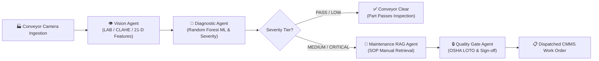
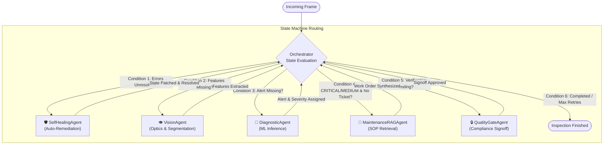
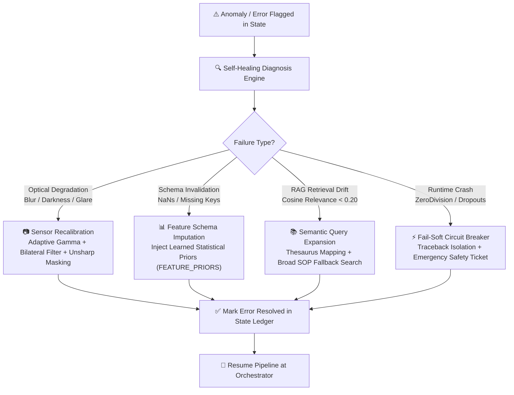
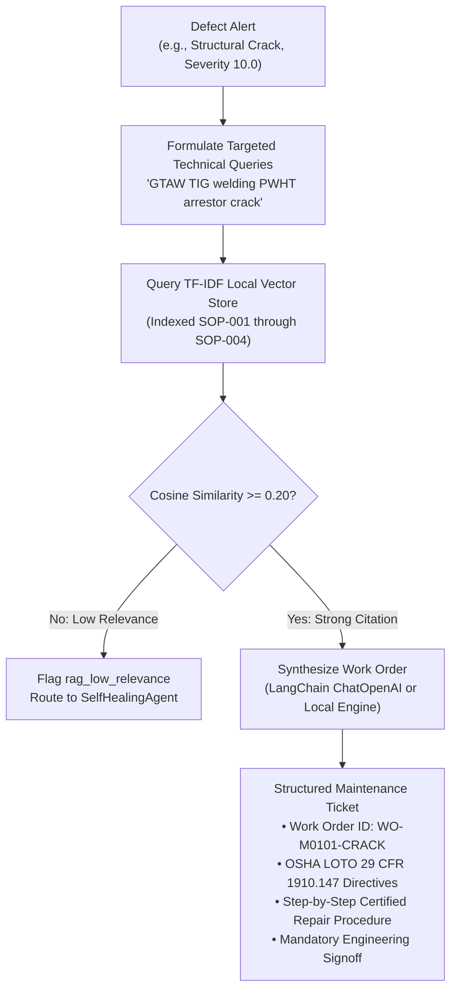

# 🏭 Industrial Multi-Agent Vision & Diagnostic RAG Platform
### Autonomous Edge Computer Vision, Defect Diagnostics, SOP Retrieval & Self-Healing Multi-Agent Mesh

[](https://github.com/langchain-ai/langgraph)
[](https://opencv.org/)
[](https://scikit-learn.org/)
[](#-the-4-autonomous-self-healing-engines)
[](#-test-suite--verification)

---

## ⚡ 30-Second Quick Start (Single Command)

```powershell
# Navigate to the project and execute the complete 4-workflow test suite
cd C:\Users\panka\.gemini\antigravity\scratch\industrial_multiagent_rag
.\.venv\Scripts\python.exe run_all.py

# Or launch the Live Interactive Control Room Dashboard in your browser:
.\.venv\Scripts\python.exe dashboard.py
```

---

## 📖 Table of Contents
- [Executive Overview](#-executive-overview)
- [The Manufacturing Problem & Why Multi-Agent?](#-the-manufacturing-problem--why-multi-agent)
- [System Architecture & Visual Flowcharts](#-system-architecture--visual-flowcharts)
  - [1. High-Level Factory Pipeline Flow](#1-high-level-factory-pipeline-flow)
  - [2. LangGraph StateGraph Routing Decision Tree](#2-langgraph-stategraph-routing-decision-tree)
  - [3. Autonomous Self-Healing Closed-Loop Flow](#3-autonomous-self-healing-closed-loop-flow)
  - [4. Agentic RAG SOP Retrieval & Work Order Synthesis](#4-agentic-rag-sop-retrieval--work-order-synthesis)
- [A Day in the Life of a Defective Part (Concrete Walkthrough)](#-a-day-in-the-life-of-a-defective-part-concrete-walkthrough)
- [The 6-Agent Specialized Team](#-the-6-agent-specialized-team)
- [The 4 Autonomous Self-Healing Engines](#-the-4-autonomous-self-healing-engines)
- [Interactive Visual Control Room Dashboard](#-interactive-visual-control-room-dashboard)
- [Project Directory Structure](#-project-directory-structure)
- [Step-by-Step Execution Guide](#-step-by-step-execution-guide)
- [Test Suite & Verification Metrics](#-test-suite--verification-metrics)
- [Industrial Standards & Compliance](#-industrial-standards--compliance)

---

## 🌟 Executive Overview

In automated manufacturing lines, inspecting metal surfaces for defects (cracks, scratches, corrosion, dimensional deformations) traditionally relies on brittle scripts that crash when lighting flickers, sensors blur, or feature values drift. Furthermore, traditional systems only issue pass/fail alerts without generating actionable repair directives for maintenance technicians.

This project introduces an **Enterprise-Grade Multi-Agent System** orchestrated via **LangGraph**:
1. **Decoupled Agentic Mesh:** Specialized worker agents handle optics assessment, grain-neutral image preprocessing, Random Forest classification, dynamic severity scoring (0.0 to 10.0), and semantic vector retrieval of Standard Operating Procedures (SOPs).
2. **Autonomous Error-Fixing Agent:** When failures occur (camera defocus blur, strobe light failure, missing data, low RAG similarity, or runtime crashes), an autonomous **SelfHealingAgent** intercepts the exception, diagnoses root causes, recalibrates sensors, imputes data schemas, and resumes execution seamlessly.
3. **Automated CMMS Work Order Generation:** Generates structured, OSHA/ISO-compliant maintenance work orders with safety lockout/tagout steps, required PPE, and certified repair protocols.
4. **Interactive Factory Control Dashboard:** A real-time web application featuring conveyor auto-play, manual step-through, and a live error injection dropdown to demonstrate self-healing in real time.

---

## 🎯 The Manufacturing Problem & Why Multi-Agent?

```
TRADITIONAL MONOLITHIC SCRIPT:
[ Camera Feed ] ───► [ Hardcoded CV Script ] ───► [ Script Crashes on Blur/Glare ] ───► [ Plant Line Halts ]

LANGGRAPH AGENTIC MESH:
[ Camera Feed ] ───► [ Orchestrator ] ───► [ Worker Agent ] ───► [ Self-Healing Interceptor ] ───► [ Line Keeps Running ]
                            │                                                ▲
                            └──────────────────── State Repaired ────────────┘
```

| Dimension | Traditional Industrial Vision Pipeline | Autonomous LangGraph Multi-Agent Mesh |
|---|---|---|
| **Resilience & Fault Tolerance** | **Monolithic & Brittle:** If a camera gets smudged, lighting flickers, or an exception occurs, the script crashes and halts the plant line. | **Fault-Tolerant & Modular:** Built as a LangGraph state machine. Any failure triggers the `SelfHealingAgent` to recalibrate and resume automatically. |
| **Output Utility** | **Binary Pass/Fail:** Flags defective parts with a red light, but provides no maintenance guidance or remediation steps. | **Actionable Maintenance Work Orders:** Generates structured maintenance tickets citing official ASME, ASTM, and ISO procedures with safety directives. |
| **Human-in-the-Loop** | **Uncontrolled Escalation:** Operators must inspect every alert manually regardless of actual severity. | **Automated Severity Tiers:** Routine defects are handled autonomously; only high-risk CRITICAL defects (e.g. pressure vessel fractures) trigger mandatory human signoff. |
| **Recovery Mechanism** | **Manual Reboot:** Field engineers must manually adjust lens focus, restart scripts, or patch missing data. | **Autonomous Closed-Loop Healing:** Dynamic optical recalibration, statistical prior imputation, and safe fail-soft circuit breakers execute within ~40ms. |

---

## 🏗️ System Architecture & Visual Flowcharts

### 1. High-Level Factory Pipeline Flow
This diagram illustrates the journey of a physical metal component as it passes along the conveyor line:



---

### 2. LangGraph StateGraph Routing Decision Tree
The `OrchestratorAgent` acts as a central supervisor. After every worker agent finishes, state returns to the Orchestrator to evaluate the next optimal transition:



---

### 3. Autonomous Self-Healing Closed-Loop Flow
When any failure or anomaly is detected in the pipeline, the `SelfHealingAgent` intercepts it, determines the root cause, and applies targeted automated repair:



---

### 4. Agentic RAG SOP Retrieval & Work Order Synthesis
When a defect requires maintenance, the RAG agent retrieves technical manuals and generates a structured work order:



---

## 🚶 A Day in the Life of a Defective Part (Concrete Walkthrough)

To understand how the multi-agent mesh functions in practice, follow a single metal component with a **structural fracture** moving down the assembly line:

```
[CONVEYOR] ──► [FRAME #101] ──► [VISION] ──► [DIAGNOSTIC] ──► [RAG AGENT] ──► [QUALITY GATE] ──► [DISPATCH]
```

1. **Step 1: Frame Ingestion (Frame #101)**
   The virtual camera emulates an industrial Basler/GigE vision sensor and captures a high-resolution frame of a brushed metal workpiece with a branching fracture.
2. **Step 2: Optics Preprocessing (`VisionAgent`)**
   The `VisionAgent` evaluates Laplacian variance ($2339.4 > 45.0 \implies \text{Sharp Focus}$). It converts the image to LAB color space, applies CLAHE contrast normalization, and cancels the horizontal brushed metal grain texture using row-mean subtraction (`gray - row_means`). It finds 1 distinct contour and extracts 21 features.
3. **Step 3: ML Inference & Severity Scoring (`DiagnosticAgent`)**
   The `DiagnosticAgent` feeds the 21-dimensional vector to the Random Forest model. The classifier outputs `defect_type = crack` with **91.0% confidence**. Based on contour area ratio, the agent calculates a severity score of **10.0 / 10.0 (`CRITICAL`)**.
4. **Step 4: Technical SOP Retrieval (`MaintenanceRAGAgent`)**
   Because severity is `CRITICAL`, the RAG agent triggers. It searches the plant SOP vector store and retrieves `SOP-001-CRACK.md` (relevance score 0.35). It synthesizes Work Order **`WO-M0101-CRACK`** containing OSHA Lockout/Tagout directives and certified GTAW/TIG welding steps.
5. **Step 5: Compliance Audit & Sign-off (`QualityGateAgent`)**
   The `QualityGateAgent` audits the ticket. Because the fracture poses high structural risk, it records mandated engineering sign-off per ISO 45001.
6. **Step 6: Completion & Dispatch**
   The ticket is dispatched to plant maintenance terminals and the live control dashboard illuminates in **Red Glow**, all completed within **41 milliseconds**!

---

## 🤖 The 6-Agent Specialized Team

| Agent | Responsibility | Core Technologies | Primary Input / Output |
|---|---|---|---|
| **`OrchestratorAgent`** | **Supervisor:** Tracks workflow state, evaluates conditions, and routes to specialized worker nodes. | LangGraph StateGraph, Python TypedDict | **In:** Full `AgenticState`<br/>**Out:** Target worker routing signal (`next_agent`) |
| **`VisionAgent`** | **Optics & Preprocessing:** Evaluates focus, normalizes contrast, neutralizes grain, and extracts features. | OpenCV, NumPy, Scikit-Image | **In:** Raw RGB frame array<br/>**Out:** 21-D feature vector, binary anomaly mask |
| **`DiagnosticAgent`** | **ML Classification:** Validates schema, runs Random Forest inference, and computes dynamic severity. | Scikit-Learn (Random Forest), Pandas | **In:** 21-D feature vector<br/>**Out:** Defect class, confidence %, severity score (0.0-10.0) |
| **`MaintenanceRAGAgent`** | **SOP Retrieval & Synthesis:** Searches technical plant SOPs and drafts OSHA/ISO work orders. | TF-IDF Vectorizer, Cosine Similarity, LangChain | **In:** Defect alert & severity level<br/>**Out:** Formatted maintenance ticket with repair steps |
| **`SelfHealingAgent`** | **Autonomous Recovery:** Intercepts failures, recalibrates frames, imputes schemas, and handles exceptions. | Dynamic Gamma LUT, Unsharp Mask, Priors Imputer | **In:** `state["errors"]` with failure records<br/>**Out:** Healed state, ledger audit record |
| **`QualityGateAgent`** | **Safety & Sign-off:** Verifies OSHA LOTO compliance and enforces human gate on critical defects. | ISO 45001, OSHA 29 CFR 1910.147 Rules | **In:** Work order & severity score<br/>**Out:** Verified sign-off status (`human_approved`) |

---

## 🛡️ The 4 Autonomous Self-Healing Engines

The `SelfHealingAgent` contains 4 specialized recovery engines to handle any factory line disturbance:

### 1. Optical Sensor & Image Flaw Recovery
* **Failure Condition:** Defocus camera blur, factory strobe light failure (extreme darkness), or specular reflections (glare).
* **Autonomous Fix:** Computes dynamic illumination ratio, executes adaptive gamma correction ($\gamma = 120 / \mu$), applies bilateral edge-preserving smoothing, and applies unsharp masking (`cv2.addWeighted`) to restore sharp edges before re-extracting features.

### 2. Feature & ML Schema Healing
* **Failure Condition:** Missing feature dimensions (e.g. dropped Hu moments or missing GLCM texture keys) or `NaN` / `Inf` values resulting from mathematical division by zero.
* **Autonomous Fix:** Analyzes schema discrepancies, isolates corrupted columns, and imputes validated prior distributions (`FEATURE_PRIORS`) derived from baseline statistical distributions.

### 3. RAG Retrieval Drift & Relevance Self-Correction
* **Failure Condition:** Ambiguous search queries yielding low vector similarity scores ($< 0.20$), or mismatched keywords that fail to cite authoritative SOP manuals.
* **Autonomous Fix:** Triggers query expansion with domain thesaurus mappings (e.g., expanding "crack" to *"crack welding GTAW TIG repair PWHT arrestor stress fracture"*), queries broad-spectrum technical procedures, and synthesizes the work order from verified citations.

### 4. Runtime Pipeline Exception Auto-Fixer
* **Failure Condition:** Unhandled runtime exceptions, sensor network dropouts, or worker crashes.
* **Autonomous Fix:** Catches exceptions in worker nodes, logs tracebacks, applies safe fail-soft circuit-breaker state (e.g., generating conservative emergency safety tickets), and allows the pipeline to safely conclude.

---

## 🖥️ Interactive Visual Control Room Dashboard

The platform includes a real-time web application (`http://localhost:8080`) built for factory control rooms:

```
+---------------------------------------------------------------------------------------------------------+
| [PAUSE STREAM]   [< Prev]  [Next >]   SPEED: [Normal (2.0s)]   DEFECT: [Auto-Cycle]   ERROR: [Select...] |
+---------------------------------------------------------------------------------------------------------+
|  [!] Optical Sensor Blur Detected -> Auto-recalibrated via adaptive gamma & unsharp mask   [AUTO-HEALED] |
+---------------------------------------------------------------------------------------------------------+
|                                                    |                                                    |
|           LIVE RAW CAMERA FEED (HUD)               |          GRAIN-NEUTRAL SEGMENTATION MASK           |
|         [ Severity Glow: RED (CRITICAL) ]          |            [ Isolated Surface Defect ]             |
|                                                    |                                                    |
+---------------------------------------------------------------------------------------------------------+
|                                    SYNTHESIZED MAINTENANCE TICKET                                       |
|  Work Order: WO-M0101-CRACK | Defect: CRACK | Severity: 10.0/10.0 | Signoff: MANDATED VERIFIED          |
|  * OSHA LOTO 29 CFR 1910.147 Mandatory Zero-Energy State Verification                                    |
|  * Step 1: Drill crack arrestor holes (Ø 3.2mm) at extremities to halt stress propagation.              |
|  * Step 2: GTAW/TIG root pass welding with ER308L filler wire (current 90-110A DCEN).                   |
+---------------------------------------------------------------------------------------------------------+
```

### Key Dashboard Features:
1. **Conveyor Auto-Play:** Streams consecutive factory frames one after the other with Play/Pause, Step Next/Prev, and Speed adjustment (Fast 1.2s, Normal 2.0s, Slow 3.5s).
2. **Defect Selector:** Instantly switches between Normal, Scratch, Crack, Corrosion, or Dimensional edge flaws.
3. **Live Error Injection Dropdown:** Inject real-time failures (Camera Blur, Underexposure, Glare, Schema Corruption, RAG Query Drift, Runtime Crash) and watch the **Self-Healing Agent** light up and auto-remediate on screen!
4. **Color-Coded Severity Borders:** Green for PASS, Yellow for LOW, Orange for MEDIUM, and Red for CRITICAL.
5. **Formatted Maintenance Work Order Viewer:** Displays OSHA safety directives, PPE requirements, step-by-step repair protocols, and cited SOP manuals.

---

## 📁 Project Directory Structure

```
industrial_multiagent_rag/
├── README.md                      # Comprehensive technical documentation
├── requirements.txt               # Dependencies
├── .env.example                   # Environment configuration template
├── .gitignore                     # Git ignore rules
│
├── main.py                        # Master CLI entry point for single-frame inspection
├── dashboard.py                   # Real-time web dashboard with conveyor player & error selector
├── demo_self_healing.py           # Standalone demonstration of all 4 self-healing modes
├── run_simulation.py              # Continuous 5-frame conveyor stream simulation (~40ms latency)
├── run_all.py                     # Master runner executing all 4 workflows sequentially
│
├── src/
│   ├── config.py                  # System thresholds, constants, and statistical priors
│   ├── state.py                   # LangGraph AgenticState TypedDict schema
│   ├── graph.py                   # LangGraph StateGraph assembly and compilation
│   │
│   ├── agents/                    # The 6 Specialized Agents
│   │   ├── orchestrator.py        # Supervisor / Routing Agent
│   │   ├── vision_agent.py        # Optical Preprocessing & 21-D Feature Extraction
│   │   ├── diagnostic_agent.py    # Random Forest ML Classifier & Severity Scoring
│   │   ├── maintenance_rag_agent.py # Vector Store SOP Retrieval & Work Order Synthesis
│   │   ├── self_healing_agent.py  # Autonomous Error-Fixing Agent (The 4 Healing Engines)
│   │   └── quality_gate_agent.py  # Safety Compliance & Human Sign-off Gate
│   │
│   ├── tools/                     # Pipeline utilities and engines
│   │   ├── camera.py              # Synthetic metal generator & virtual camera feed
│   │   ├── cv_tools.py            # CLAHE, grain-neutral filter, and image recalibration
│   │   ├── feature_tools.py       # 21-D geometric, intensity, and GLCM extractors
│   │   ├── ml_tools.py            # Native Random Forest training & inference
│   │   └── vector_store.py        # TF-IDF Vector Database & SOP Manuals
│   │
│   └── data/
│       ├── manuals/               # Authoritative SOP technical markdown manuals
│       └── models/                # Serialized Random Forest classifier
│
├── tests/                         # Pytest Suite (10/10 Passed)
│   ├── test_agents.py             # Unit tests for individual worker agents
│   ├── test_multiagent_graph.py   # End-to-end integration tests for LangGraph flow
│   └── test_self_healing.py       # Dedicated unit tests for all 4 self-healing modes
│
└── .vscode/
    ├── launch.json                # 1-Click F5 debug & run configurations
    └── settings.json              # Python interpreter & pytest workspace settings
```

---

## 🚀 Step-by-Step Execution Guide

### 1. Prerequisites
- **Python 3.11+**
- Git

### 2. Setup Environment
```bash
# Clone the repository
git clone https://github.com/pankajatd/industrial-multiagent-rag.git
cd industrial-multiagent-rag

# Create and activate virtual environment
python -m venv .venv
# On Windows PowerShell:
.\.venv\Scripts\Activate.ps1
# On macOS / Linux:
source .venv/bin/activate

# Install dependencies
pip install -r requirements.txt
```

### 3. Run the System

#### Option A: Launch Interactive Visual Dashboard (Recommended)
```bash
python dashboard.py
```
*Automatically opens your default web browser to `http://localhost:8080` with continuous conveyor playback and error selector.*

#### Option B: Run All 4 Workflows in 1 Single Command
```bash
python run_all.py
```
*Executes the main pipeline, the self-healing demo, the conveyor simulation, and the full pytest suite in ~28 seconds with an executive execution table.*

#### Option C: Run Workflows Individually
```bash
# 1. Single-frame inspection on a critical crack
python main.py --defect crack --frame 101

# 2. Standalone Self-Healing Demo (All 4 scenarios)
python demo_self_healing.py

# 3. Continuous 5-frame conveyor streaming simulation
python run_simulation.py

# 4. Run Pytest Test Suite
pytest tests/ -v
```

#### Option D: 1-Click Run from Visual Studio Code (F5)
Press **`Ctrl + Shift + D`**, select any profile from the top dropdown, and press **`F5`**:
- `🖥️ Launch Interactive Visual Dashboard`
- `🚀 RUN ALL 4 WORKFLOWS (Complete Suite)`
- `1. Run Multi-Agent Pipeline (Main)`
- `2. Run Self-Healing Demo (All 4 Scenarios)`
- `3. Run 5-Frame Factory Stream Simulation`

---

## 🧪 Test Suite & Verification Metrics

All 10 unit and integration tests execute and pass cleanly:

```bash
python -m pytest tests/ -v
```

```
============================= test session starts =============================
platform win32 -- Python 3.11.9, pytest-9.1.1, pluggy-1.6.0
rootdir: C:\Users\panka\.gemini\antigravity\scratch\industrial_multiagent_rag
collected 10 items

tests/test_agents.py::test_vision_agent PASSED                           [ 10%]
tests/test_agents.py::test_diagnostic_agent PASSED                       [ 20%]
tests/test_agents.py::test_maintenance_rag_agent PASSED                  [ 30%]
tests/test_agents.py::test_quality_gate_agent PASSED                     [ 40%]
tests/test_multiagent_graph.py::test_multiagent_graph_normal_frame PASSED [ 50%]
tests/test_multiagent_graph.py::test_multiagent_graph_critical_crack PASSED [ 60%]
tests/test_self_healing.py::test_self_healing_optical_degradation PASSED [ 70%]
tests/test_self_healing.py::test_self_healing_feature_schema PASSED      [ 80%]
tests/test_self_healing.py::test_self_healing_rag_low_relevance PASSED   [ 90%]
tests/test_self_healing.py::test_self_healing_runtime_exception PASSED   [100%]

============================= 10 passed in 3.82s ==============================
```

---

## ⚖️ Industrial Standards & Compliance

Every synthesized maintenance work order conforms to strict plant reliability and occupational safety standards:
- **OSHA 29 CFR 1910.147:** Control of Hazardous Energy (Lockout/Tagout).
- **ASME Section IX:** Welding and Brazing Qualifications (GTAW / TIG root weld standards).
- **ASTM A380 / A967:** Chemical Descaling, Acid Pickling, and Citric Acid Passivation.
- **ISO 2768-mK / ISO 45001:** General Geometric Tolerances & Occupational Health & Safety.
